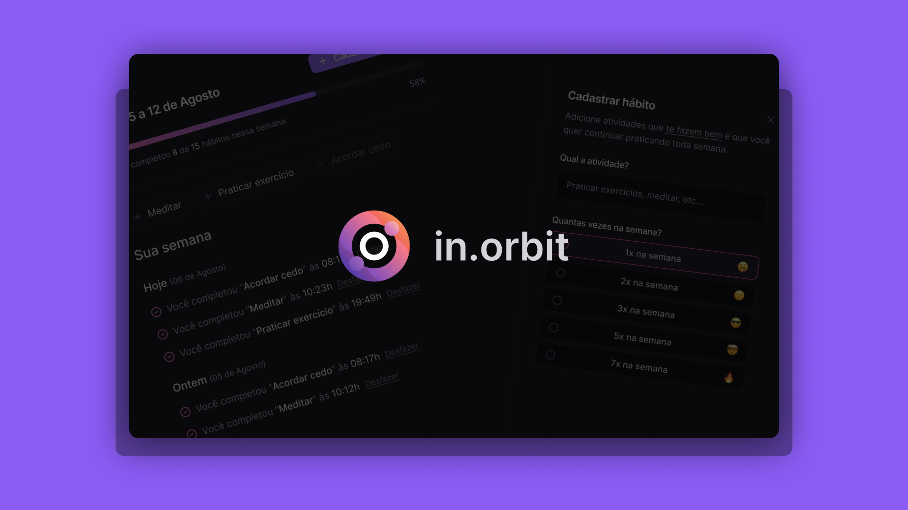

# In.orbit | Project of NLW Pocket
[](#)

With the **Plann.er**, you can create travel plans, invite friends and write down activities to perform during the trip!

> Status: Finished... ✅

## Technologies 🚀


## Libs 📕

📑 **ZOD**

📑 **LUCIDE ICONS**

📑 **ESLINT**

📑 **AXIOS**

## Features 💡

✅ **CREATE GOAL**

✅ **LIST GOALS**

## How do use the project ⚙️

### Frontend

#### 1. Enter in web directory
```sh
git clone https://github.com/reinheimermat/planner-web
cd planner-web/web
```
#### 2. install dependencies
```sh
pnpm install
```
#### 3. Run local project
```sh
pnpm run dev
```
#### 4. Access the project
```sh
http://localhost:5173/
```
### Backend

#### 1. Enter in server directory
```sh
git clone https://github.com/reinheimermat/planner-api
cd planner-api/server
```
### 2. Config envoriments
Rename the file **.env.example** to **.env**

### 3. Install dependencies
```sh
pnpm run dev
```
### 4. Run docker
```sh
docker compose up -d 
```

### 5. Run the project
```sh
pnpm run dev
```

## License 📝

[](https://github.com/Ileriayo/markdown-badges/blob/master/LICENSE)